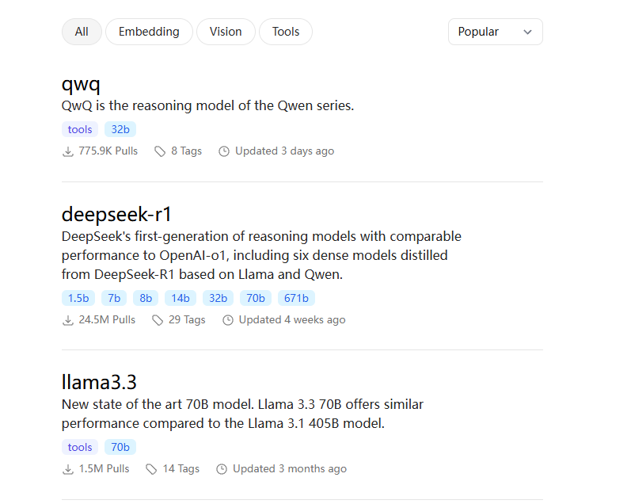
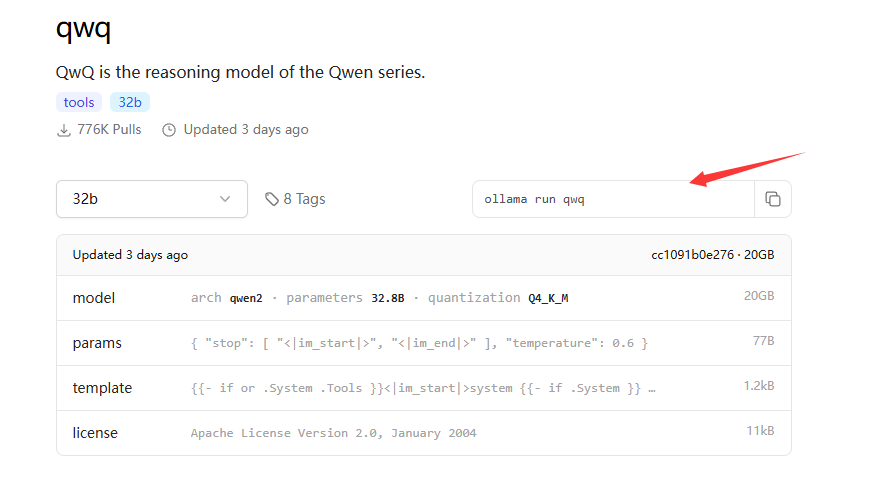
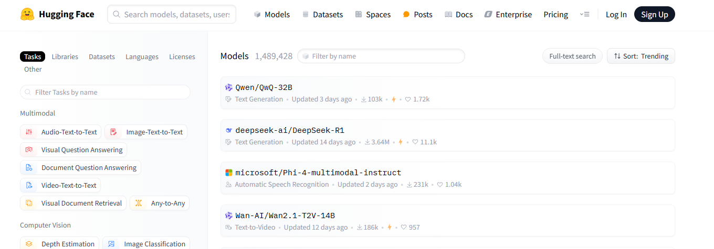
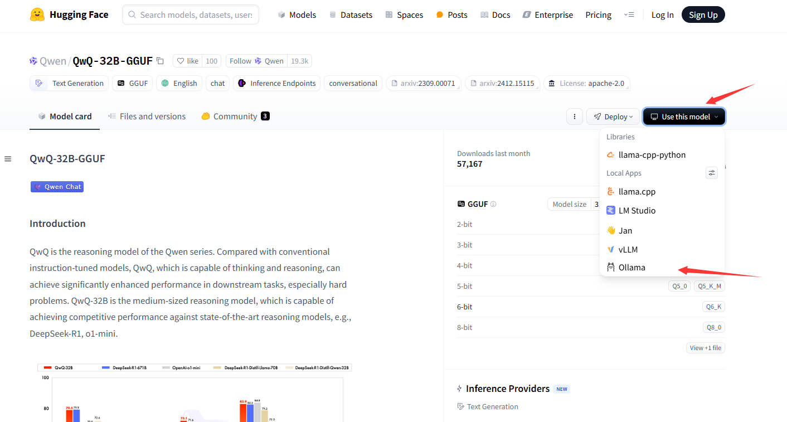
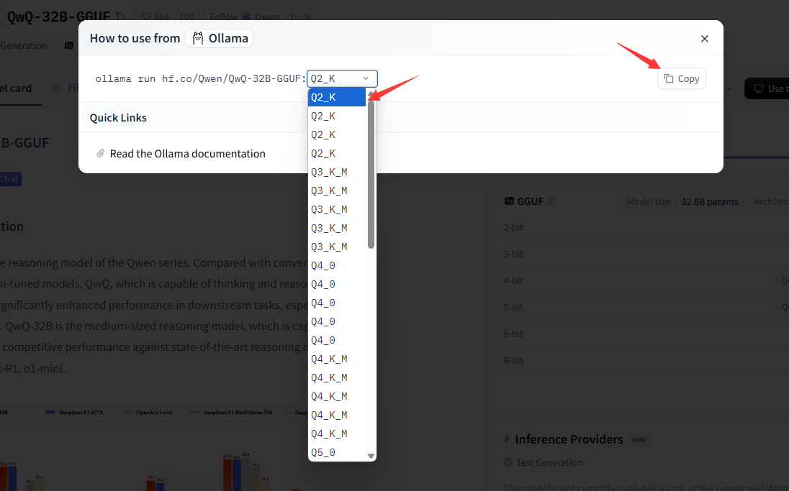

大模型运行时采用Ollama，Ollama 是一个开源的本地大语言模型运行框架，专为在本地机器上便捷部署和运行大型语言模型（LLM）而设计。Ollama 支持多种操作系统，包括 macOS、Windows、Linux 以及通过 Docker 容器运行。Ollama 提供对模型量化的支持，可以显著降低显存要求，使得在普通家用计算机上运行大型模型成为可能。

#### Ollama安装

Ollama 对硬件要求不高，旨在让用户能够轻松地在本地运行、管理和与大型语言模型进行交互。

- Windows：
  - 打开浏览器，访问 Ollama 官方网站：<https://ollama.com/download>，下载适用于 Windows 的安装程序。
- Linux：
  - Linux 下可以使用一键安装脚本，运行命令：`curl -fsSL https://ollama.com/install.sh | bash`

安装完成之后，通过`ollama --version` 验证安装。

#### Ollama运行模型

Ollama 运行模型使用 **ollama run** 命令。

```bash
ollama run xxx:yyy # xxx为模型名称，yyy为模型版本
```

若本地不存在该模型，Ollama会自动从服务器拉取。模型列表可以从Ollama官方[链接](https://ollama.com/search)找到。





选择合适的模型，打开选择模型参数，然后复制命令到终端运行，即可自动部署。

若需要部署第三方模型或者其它开源模型，可访问[huggingface](https://huggingface.co/models)。



选择合适的模型，然后选择使用该模型。(注意：选择模型时，应选择ollama支持的GGUF格式的模型版本。)



选择适合硬件的量化方案之后，复制该命令到终端，执行，Ollama会自动拉取该镜像。



国内huggingface会被限制访问，可将使用镜像网站：[hf-mirror.com](https://hf-mirror.com/)。拉取模型时，将`hf.co`替换为`hf-mirror.com` 。例如：

```bash
ollama run hf-mirror.com/Qwen/QwQ-32B-GGUF:Q4_0
```

#### API

Ollama 提供了基于 HTTP 的 API，允许开发者通过编程方式与模型进行交互。默认情况下，服务会运行在 `http://localhost:11434`。

Ollama 提供了以下主要 API 端点：

生成文本（Generate Text）

- **端点**：`POST /api/generate`

- **功能**：向模型发送提示词（prompt），并获取生成的文本。

- **请求格式**：

  ```
  {
    "model": "<model-name>",  // 模型名称
    "prompt": "<input-text>", // 输入的提示词
    "stream": false,          // 是否启用流式响应（默认 false）
    "options": {              // 可选参数
      "temperature": 0.7,     // 温度参数
      "max_tokens": 100       // 最大 token 数
    }
  }
  ```

- **响应格式**：

  ```
  {
    "response": "<generated-text>", // 生成的文本
    "done": true                    // 是否完成
  }
  ```

##### 聊天（Chat）

- **端点**：`POST /api/chat`

- **功能**：支持多轮对话，模型会记住上下文。

- **请求格式**：

  ```
  {
    "model": "<model-name>",  // 模型名称
    "messages": [             // 消息列表
      {
        "role": "user",       // 用户角色
        "content": "<input-text>" // 用户输入
      }
    ],
    "stream": false,          // 是否启用流式响应
    "options": {              // 可选参数
      "temperature": 0.7,
      "max_tokens": 100
    }
  }
  ```

- **响应格式**：

  ```
  {
    "message": {
      "role": "assistant",    // 助手角色
      "content": "<generated-text>" // 生成的文本
    },
    "done": true
  }
  ```

##### 列出本地模型（List Models）

- **端点**：`GET /api/tags`

- **功能**：列出本地已下载的模型。

- **响应格式**：

  ```
  {
    "models": [
      {
        "name": "<model-name>", // 模型名称
        "size": "<model-size>", // 模型大小
        "modified_at": "<timestamp>" // 修改时间
      }
    ]
  }
  ```

##### 拉取模型（Pull Model）

- **端点**：`POST /api/pull`

- **功能**：从模型库中拉取模型。

- **请求格式**：

  ```
  {
    "name": "<model-name>" // 模型名称
  }
  ```

- **响应格式**：

  ```
  {
    "status": "downloading", // 下载状态
    "digest": "<model-digest>" // 模型摘要
  }
  ```

##### 启用流式响应

同时，Ollama还支持流式响应，该功能适用于实时生成文本的场景。
在请求中设置 **"stream": true**，API 会逐行返回生成的文本。

```bash
curl http://localhost:11434/api/generate -d '{
  "model": "deepseek-coder",
  "prompt": "你好，你能帮我写一段代码吗？",
  "stream": true
}'
```

- 响应格式

每行返回一个 JSON 对象：

```bash
{
  "response": "<partial-text>",  // 部分生成的文本
  "done":   false                // 是否完成
}
```


#### python调用ollama的API

- 非流式调用采用python的requests库

```python
def ollama(prompt):
    with requests.post(ollama_base_url,json={
        "model": llm_model_name,
        "prompt": prompt,
        "stream": False,
        "options": {
            "temperature": 0,
            "max_tokens": 64800
        }
    }) as response:
        return response.json()['response']
```

- 流式调用相对于非流式要复杂一些，采用aiohttp库，并使用异步的写法

```python 
async def ollama_stream(prompt):
    async with aiohttp.ClientSession() as session:
        async with session.post(ollama_base_url,json={
            "model": llm_model_name,  
            "prompt": prompt, 
            "stream": True,          
            "options": {              
                "temperature": 0,     
                "max_tokens": 64800       
                }
            }) as response:
            ans = []
            sentence = ''
            response.raise_for_status()
            try:
                async for reses in response.content.iter_any():
                    lines = reses.decode('utf-8').split('\n')
                    for line in lines:
                        if line:
                            response_text = json.loads(line)['response']
                            sentence += response_text
                            if response_text == '。' or response_text == '？' or response_text == '！' or response_text == '\n' or response_text == '\n\n' :
                                ans.append(sentence)
                                sentence.replace('\n','')
                                yield sentence
                                sentence = ''
            except Exception as e:
                print(e)
                return
```

流式返回的代码中进行了一定的处理，是的返回的内容并非直接返回ollama的数据流，而是当生成完整的一个句子之后，返回该语句。这样的做法有助于衔接TTS引擎，是的用户不用等待过长的时间才能听到语音的回复。