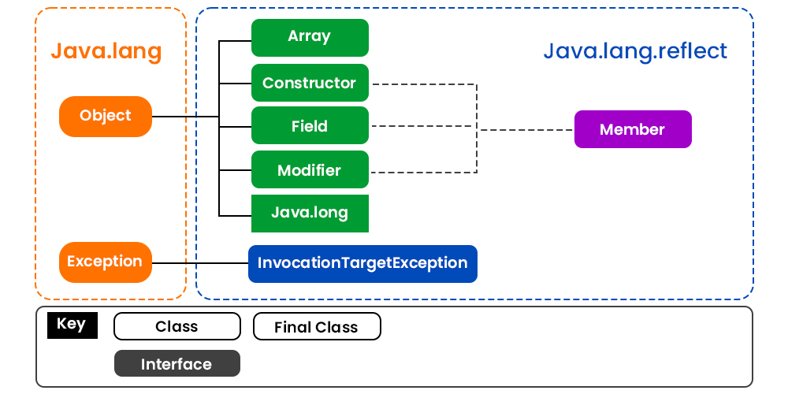

---

title: java学习笔记（4）

published: 2025-03-10

description: 'Java学习之路'

image: './img/ff.JPG'

tags: [java, 学习, 虚函数]

category: 'java'

draft: false 

---

## 虚函数

虚函数的存在是为了多态。Java 中其实没有虚函数的概念，它的普通函数就相当于 C++ 的虚函数，动态绑定是Java的默认行为。如果 Java 中不希望某个函数具有虚函数特性，可以加上 final 关键字变成非虚函数。

### C++的虚函数

虚函数是C++中实现多态的一种机制。当基类中的某个函数被声明为虚函数时，其派生类中的同名函数自动成为虚函数，无论是否使用`virtual`关键字。

c++中的虚函数主要作用是允许在派生类中重新定义基类的函数，以便实现特定的行为。通过基类指针或引用调用虚函数时，能够根据实际对象的类型来决定调用哪个函数，从而实现运行时多态。

如果在基类中**没有定义虚函数**，**派生类可以调用基类中的非虚函数**。即使基类中的函数没有被定义为虚函数，派生类仍然可以继承并调用这些函数。在这种情况下，派生类对基类函数的调用是通过静态绑定进行的，即在编译时就已经确定了要调用的函数。

1. **继承**：派生类继承基类的所有非私有成员函数，包括非虚函数。因此，派生类对象可以调用这些继承来的非虚函数。
2. **静态绑定**：对于非虚函数，调用哪个函数是在编译时确定的，基于对象的静态类型（即声明时的类型）而不是动态类型（即实际对象的类型）。
3. **覆盖与重载**：如果派生类定义了一个与基类中非虚函数同名但参数列表不同的函数，这被称为重载，而不是覆盖。调用哪个函数将基于函数的参数列表和对象的静态类型。
4. **访问控制**：派生类调用基类非虚函数的权限取决于基类中该函数的访问级别（如public、protected或private）。如果基类函数是私有的，派生类将无法直接调用它。

**需要注意的是**，如果希望在派生类中修改基类函数的行为，并且希望这种修改在通过基类指针或引用调用时生效（即实现多态），那么应该将基类中的相应函数声明为虚函数。非虚函数的调用不会实现多态行为。

### C++的虚基类

**虚基类**是C++中用于解决多继承时可能出现的二义性问题的一种机制。当某个类在多条继承路径上被多次继承时，如果不使用虚基类，那么这个类的成员变量和成员函数可能会在派生类中存在多个副本，导致二义性和资源浪费。
**概念：**

1. **虚继承**：虚基类是通过虚继承来实现的。在声明继承关系时，使用`virtual`关键字来指定基类为虚基类。
2. **共享副本**：通过虚继承，无论虚基类在继承层次中出现了多少次，派生类中都只包含虚基类的一个共享副本。
3. **虚基类表**：为了实现这种共享，编译器会为每个包含虚基类的对象添加一个虚基类表，用于记录虚基类成员的偏移量。
**用法：**
1. **声明虚基类**：在继承时使用`virtual`关键字。
   ```cpp
   class A { /* ... */ };
   class B : virtual public A { /* ... */ };
   class C : virtual public A { /* ... */ };
   class D : public B, public C { /* ... */ };
   ```
   在这个例子中，`A`是`B`和`C`的虚基类，`D`通过`B`和`C`间接继承了`A`，但`A`的成员在`D`中只有一个副本。
2. **构造函数调用**：虚基类的构造函数由最派生的类负责调用，而不是由直接继承的子类调用。
   ```cpp
   class A {
   public:
       A() { /* ... */ }
   };
   class B : virtual public A {
   public:
       B() { /* ... */ } // 不调用A的构造函数
   };
   class C : virtual public A {
   public:
       C() { /* ... */ } // 不调用A的构造函数
   };
   class D : public B, public C {
   public:
       D() : A(), B(), C() { /* ... */ } // 由D负责调用A的构造函数
   };
   ```
3. **避免二义性**：使用虚基类可以避免在多继承情况下对基类成员的访问产生二义性。
   ```cpp
   D d;
   d.someMemberOfA; // 无二义性，因为A的成员在D中只有一个副本
   ```
**注意事项：**
- 虚基类主要解决的是多继承中的二义性问题，并不是所有多继承场景都需要使用虚基类。
- 虚基类的构造函数由最派生的类负责调用，因此需要确保最派生的类能够访问到虚基类的构造函数。
- 虚继承会引入一些额外的开销，如虚基类表，因此在使用时应权衡其利弊。
通过合理使用虚基类，可以有效地管理多继承关系，避免潜在的二义性和资源浪费问题。

## 抽象类
在Java中，可以使用`abstract`关键字来将一个方法标记为抽象方法，这样继承类就必须实现该方法。抽象方法没有方法体，只有方法签名。包含抽象方法的类也必须被声明为抽象类。
以下是一个示例：
```java
// 声明一个抽象类
public abstract class AbstractClass {
    // 声明一个抽象方法
    public abstract void abstractMethod();
}
// 继承抽象类
public class ConcreteClass extends AbstractClass {
    // 实现抽象方法
    @Override
    public void abstractMethod() {
        // 方法实现
        System.out.println("实现了抽象方法");
    }
}
```
在这个示例中，`AbstractClass`是一个抽象类，它包含了一个抽象方法`abstractMethod()`。`ConcreteClass`继承了`AbstractClass`，并且必须实现`abstractMethod()`方法。
如果不实现抽象方法，那么继承类也必须被声明为抽象类。例如：
```java
// 另一个继承抽象类的类，没有实现抽象方法
public abstract class AnotherAbstractClass extends AbstractClass {
    // 可以添加其他方法或属性
}
```
在这个例子中，`AnotherAbstractClass`继承了`AbstractClass`但没有实现`abstractMethod()`，因此它也必须被声明为抽象类。

Java的反射机制是Java语言的一个重要特性，它允许程序在运行时获取任意类的内部信息，包括类的方法、属性、构造器等，并且可以动态地创建对象、调用方法、访问属性。这种机制极大地提高了Java的灵活性和动态性，但同时也带来了一些性能开销和安全性问题。

## 反射机制的基本概念
1. **Class类**：Java中的每个类都有一个对应的Class对象，这个对象包含了类的所有信息。通过Class对象，可以获取类的构造器、方法、属性等。
2. **Constructor类**：代表类的构造器。
3. **Method类**：代表类的方法。
4. **Field类**：代表类的属性（字段）。
5. **Modifier类**：提供了一系列静态方法来解析类的访问修饰符。
### 反射的基本用法
#### 获取Class对象
- 通过类名：`Class<?> clazz = String.class;`
- 通过对象：`Class<?> clazz = "hello".getClass();`
- 通过全限定名：`Class<?> clazz = Class.forName("java.lang.String");`
#### 获取构造器
- `Constructor<?>[] constructors = clazz.getConstructors();` // 获取所有公共构造器
- `Constructor<?> constructor = clazz.getConstructor(String.class);` // 获取特定公共构造器
- `Constructor<?>[] constructors = clazz.getDeclaredConstructors();` // 获取所有构造器，包括私有
- `Constructor<?> constructor = clazz.getDeclaredConstructor(String.class);` // 获取特定构造器，包括私有
#### 创建对象
- `Object obj = constructor.newInstance("hello");` // 调用构造器创建对象
#### 获取方法
- `Method[] methods = clazz.getMethods();` // 获取所有公共方法
- `Method method = clazz.getMethod("toString");` // 获取特定公共方法
- `Method[] methods = clazz.getDeclaredMethods();` // 获取所有方法，包括私有
- `Method method = clazz.getDeclaredMethod("someMethod", String.class);` // 获取特定方法，包括私有
#### 调用方法
- `Object result = method.invoke(obj, "param");` // 调用方法，obj为对象实例，param为参数
#### 获取属性
- `Field[] fields = clazz.getFields();` // 获取所有公共属性
- `Field field = clazz.getField("someField");` // 获取特定公共属性
- `Field[] fields = clazz.getDeclaredFields();` // 获取所有属性，包括私有
- `Field field = clazz.getDeclaredField("someField");` // 获取特定属性，包括私有
#### 访问属性
- `Object value = field.get(obj);` // 获取属性值
- `field.set(obj, "newValue");` // 设置属性值
### 反射的应用场景
1. **框架开发**：如Spring、Hibernate等框架大量使用反射来实现依赖注入、对象关系映射等功能。
2. **动态代理**：如Java的动态代理机制，通过反射来动态创建代理类。
3. **代码分析工具**：如IDE、代码生成器等工具使用反射来分析代码结构。
4. **测试框架**：如JUnit使用反射来识别和调用测试方法。
### 反射的注意事项
1. **性能开销**：反射操作相比直接代码调用会有较大的性能开销。
2. **安全性问题**：反射可以绕过类的访问控制，可能会破坏封装性，导致安全问题。
3. **代码可读性**：过度使用反射会使代码难以理解和维护。
4. **异常处理**：反射操作会抛出如`ClassNotFoundException`、`NoSuchMethodException`等异常，需要妥善处理。
### 示例代码
```java
public class ReflectionDemo {
    public static void main(String[] args) throws Exception {
        // 获取Class对象
        Class<?> clazz = Class.forName("java.lang.String");
        // 获取构造器并创建对象
        Constructor<?> constructor = clazz.getConstructor(String.class);
        Object obj = constructor.newInstance("hello");
        // 获取方法并调用
        Method method = clazz.getMethod("toUpperCase");
        Object result = method.invoke(obj);
        // 输出结果
        System.out.println(result); // 输出：HELLO
    }
}
```
这个示例展示了如何使用反射来获取String类的构造器、创建对象、获取方法并调用方法。通过这个简单的例子，可以初步了解Java反射机制的基本用法。在实际应用中，反射通常用于更复杂和动态的场景。
#### 获取接口和父类
```java
Class<?> clazz = Person.class;

// 获取所有接口
Class<?>[] interfaces = clazz.getInterfaces();
for (Class<?> i : interfaces) {
    System.out.println("Interface: " + i.getName());
}

// 获取父类
Class<?> superClass = clazz.getSuperclass();
System.out.println("Superclass: " + superClass.getName());
```

## `java.lang.reflect`
`java.lang.reflect` 是 Java 反射机制的核心包，提供了操作类及其成员（字段、方法、构造函数等）的类和接口。通过这些 API，开发者可以在运行时动态地查询和修改类的结构。


> [图片来源：https://www.runoob.com/](https://www.runoob.com/java/java-reflection.html)
1. Class 类
- 功能：表示类的对象，提供了获取类信息的方法，如字段、方法、构造函数等。
- 主要方法：
    - getFields()：获取所有公共字段。
    - getDeclaredFields()：获取所有声明的字段，包括私有字段。
    - getMethods()：获取所有公共方法。
    - getDeclaredMethods()：获取所有声明的方法，包括私有方法。
    - getConstructors()：获取所有公共构造函数。
    - getDeclaredConstructors()：获取所有声明的构造函数，包括私有构造函数。
    - getSuperclass()：获取类的父类。
    - getInterfaces()：获取类实现的所有接口。
2. Field 类
- 功能：表示类的字段（属性），提供了访问和修改字段值的方法。
- 主要方法：
    - get(Object obj)：获取指定对象的字段值。
    - set(Object obj, Object value)：设置指定对象的字段值。
    - getType()：获取字段的数据类型。
    - getModifiers()：获取字段的修饰符（如 public、private）。
3. Method 类
- 功能：表示类的方法，提供了调用方法的能力。
- 主要方法：
    - invoke(Object obj, Object... args)：调用指定对象的方法。
    - getReturnType()：获取方法的返回类型。
    - etParameterTypes()：获取方法的参数类型。
    - etModifiers()：获取方法的修饰符（如 public、private）。
4. Constructor 类
- 功能：表示类的构造函数，提供了创建对象的能力。
- 主要方法：
    - newInstance(Object... initargs)：创建一个新实例，使用指定的构造函数参数。
    - getParameterTypes()：获取构造函数的参数类型。
    - getModifiers()：获取构造函数的修饰符（如 public、private）。